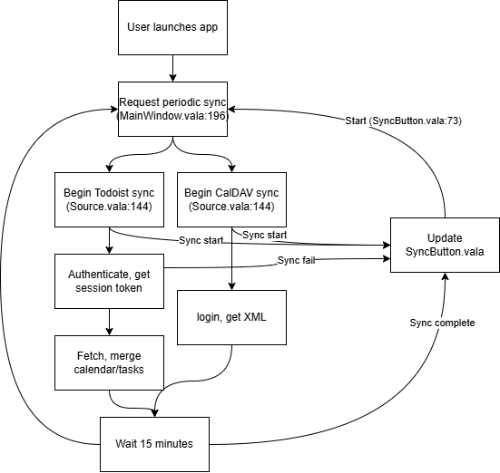

# Design Outline

At a high level, there are two main components to the application: the frontend and the backend. The frontend implements all of the logic for assembling the UI, displaying data, and listening for user interaction using the GTK GUI library. The backend is responsible for the business logic in handling user input, making necessary changes to models, and saving to the database.

The frontend is stored in the src folder, and there are various Views, which contain Layouts composed of Widgets, which are the actual UI components that the user can interact with. The backend is stored in the core folder, and each of the models used by the application are in `core/Objects`. These objects are sent to the Views, which uses the data to populate the UI. The Controller is implemented in the `core/Services/Store.vala` file. Views receive data from the Store by subscribing to certain events. When specific models are updated, it will notify the subscribed views with the new object to refresh the UI. When Views receive user interaction events, they will call methods in the Store to handle the user data. The Store will then handle any logic, and store the updated state of the object.

# Design Details

Database schema: [core/Services/Database.vala](https://github.com/alainm23/planify/blob/4e40a7244c1d2b564e97e65508481f7c2e6ff038/core/Services/Database.vala)
Class schema: [core/Objects](https://github.com/alainm23/planify/tree/4e40a7244c1d2b564e97e65508481f7c2e6ff038/core/Objects)

## Class Diagram

The class structure is highly intertwined between a few key objects: Item, Project, and Section. For each project, there are multiple sections, with each section having a project variable referring to the project it belongs to. And within those sections, there are multiple items, which is synonymous with tasks. Additionally, each project can contain subprojects, and if a given project is a subproject then it has a parent project. Items can contain subitems, which are partitioned into incomplete items and all items. Each item also contains a project and section object, referring to which objects it belongs to, as well as lists of reminders and attachments. ObjectEvents have DueDate objects for the specific due date of the given object.

## Opening the application

```mermaid
sequenceDiagram
        title Opening Planify

        participant User
        participant Application
        participant Database
        participant External Data Source

        User->>Application:Open application
        Application->>Database:Request data
        Database->>Application:Return data
        Application->>External Data Source:Start Sync
        External Data Source-->>Application:Updated events

        Application->>User:Initialize UI with data
```

When the user opens the application, the App.vala runs MainWindow.vala to initialize the application. First the app starts the Sqlite database and connects to it ([src/MainWindow.vala\#L156](https://github.com/alainm23/planify/blob/master/src/MainWindow.vala#L156)). The database will return the stored data, including any external data sources that the program should synchronize with. Then, the program will start the synchronization process for all connected external data sources ([src/MainWindow.vala\#L198](https://github.com/alainm23/planify/blob/master/src/MainWindow.vala#L198)). The data will be fetched asynchronously. Finally, the UI is populated with the loaded data and displayed to the user.

## Switching pages

The Planify app has three main Views. The label list ([src/Views/Label](https://github.com/alainm23/planify/tree/master/src/Views/Label)), the task list ([src/Views/Project/List.vala](https://github.com/alainm23/planify/blob/master/src/Views/Project/List.vala)), and the day list ([src/Views/Scheduled](https://github.com/alainm23/planify/tree/master/src/Views/Scheduled)). As the user, as you navigate around the application, you can transition between these different states, changing which view is in your main window. By using the Inbox, Today, Scheduled, and Labels buttons in the sidebar, you can transition between those modes, which have specific Views associated with them. For example, if you press the Labels button, that will open a label list view. If you click on a specific label, you will be transitioned to a task list view with all of the tasks with that label attached. From here, you could transition to the day list view by pressing the Scheduled button in the sidebar.

## Adding a new task

```mermaid
sequenceDiagram
    participant Client
    participant Application
    participant Database

    Client->>Application: Create new Item
    Application->>Database: Store item in project
    Application-->>Client: returns requested information
    Client->>Client: Displays information
```
From `Filter.vala`, the function `create_new_task()` is called, which calls the function `Services.Store.instance ().get_project(Services.Settings.get_default().settings.get_string("local-inbox-project-id"));` From this command, the backend will update the database, and then return the updated information to the client to be displayed in the user interface.

## Synchronization

Within MainWindow.vala, it registers a callback that executes a sync every 15 minutes.
[src/MainWindow.vala\#L196](https://github.com/alainm23/planify/blob/acca39066b3dd02545c693e5c0614655e352d73c/src/MainWindow.vala#L196)

Within `Source.vala`, there is a public `run_server` method, which calls a private `_run_server` method. This then either calls `sync.start` for a CalDAV source or Todoist source, depending on the type.
[core/Objects/Source.vala\#L129](https://github.com/alainm23/planify/blob/acca39066b3dd02545c693e5c0614655e352d73c/core/Objects/Source.vala#L129)

For Todoist sources, it must retrieve a session token from the Todoist API. It makes various other API calls to merges or deletes calendars/tasks as necessary.
[core/Services/Todoist.vala\#L210](https://github.com/alainm23/planify/blob/4e40a7244c1d2b564e97e65508481f7c2e6ff038/core/Services/Todoist.vala#L210)

For CalDAV Sources, it retrieves the authentication bearer token from storage, authenticates, retrieves & parses the XML, and merges or deletes calendars/tasks as necessary.
[core/Services/CalDAV/Core.vala\#L234](https://github.com/alainm23/planify/blob/master/core/Services/CalDAV/Core.vala#L234)

`SyncButton.vala` has the ability to manually trigger a sync by broadcasting on its clicked signal. It also responds to events dispatched from the sources and updates its appearance accordingly when syncs start, fail, or finish.
[src/Widgets/SyncButton.vala\#L73](https://github.com/alainm23/planify/blob/master/src/Widgets/SyncButton.vala#L73)

## Reminders

When a reminder is created in the UI or loaded from the database at startup, it will run `reminder_added()` in [Notification.vala](https://github.com/alainm23/planify/blob/master/src/Services/Notification.vala#L60). The code will first check if the time of the notification has already passed, and if it has, it will trigger the notification. If not, it will check whether or not the reminder is due today. If it is due today, it will set a timeout for the remaining time until the notification is due. If it is not due, it will not do anything. However, in [TimeMonitor.vala](https://github.com/alainm23/planify/blob/master/src/Services/TimeMonitor.vala), there is always a timeout set for midnight. At midnight, it will call `refresh()`, causing `Notification.vala` to rerun `reminder_added()` for all reminders. This in effect causes all reminders to check if they are due again, since it is now a new day. This loop continues until all reminders have been triggered.
